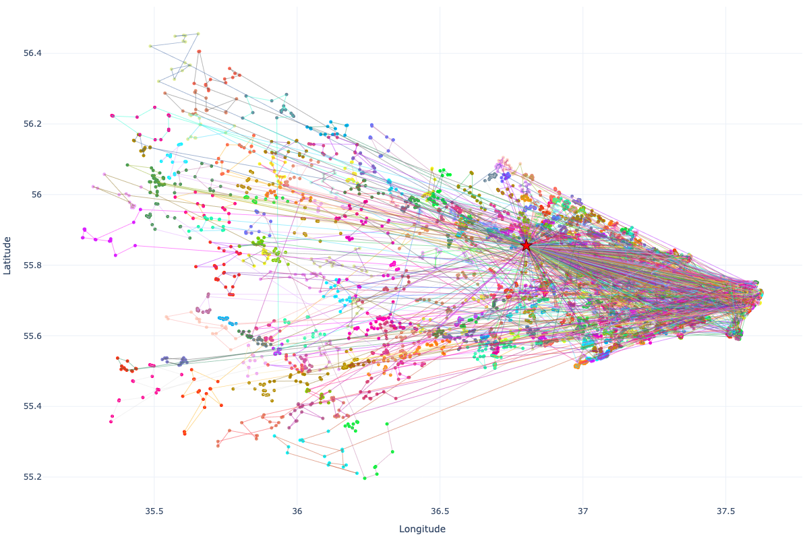

# E-CUP-2025-ML-Challenge-VRP


## 1) Суть задачи 
- Формулировка: Vehicle Routing Problem (VRP) с одним складом (ID=1). Есть курьеры и заказы, сгруппированные по «микрополигонам» (MpId). Каждый полигон содержит набор точек доставки.
- Ограничения:
  - Время работы курьера ≤ 12 часов (43200 сек) в интервале 8:00–20:00.
  - Полигон обслуживается одним курьером целиком (атомарность по MpId).
  - Время обслуживания зависит от пары (курьер, MpId) и умножается на количество заказов в этом MpId.
- Целевая функция: минимизируем суммарное время маршрутов всех курьеров + штраф 3000 секунд за каждый нераспределённый заказ.
- Статичность данных: все входы известны заранее. Это позволяет агрессивно подготовить вспомогательные структуры (БД портов, порталы полигонов), использовать сильные эвристики и разложения (для этого сделаны специальные ноутбуки в `notebooks/` для матстата).

<p align="center">
  
  <br/>
  <i>Визуализация решаемой задачи</i>
</p>

## 2) Декомпозиции
- Микрополигоны (MpId): заказы агрегируются по MpId на этапе загрузки (Polars). Это уменьшает размерность: вместо оптимизации по всем точкам, мы решаем по «узлам» MpId.
- Порталы полигонов: для каждого MpId выбираем «портал» — удобную входную/выходную точку (по геометрии и локальным дистанциям). Внутриполигонный обход (TSP) строится вокруг портала: маршрут внутри полигона начинается/заканчивается в этом портале.
- Супер-полигоны: близкие MpId (по портальным расстояниям, геометрии и суммарному времени сервиса) объединяются в кластеры. Для назначения курьерам мы оперируем представителями кластеров (macro-level), а затем «раскрываем» к полному списку MpId (micro-level) в порядке порталов кластера.
- Сектора (опционально): раскладываем полигоны по угловым секторам относительно склада. Это локализует назначение и упрощает конкуренцию между далёкими частями города. Есть геометрическая версия (по углам) и обучаемая (SectorPolicy, PyTorch) — выбор центров бинов по гистограмме углов.
- Двухэтапность пайплайна: (A) назначение MpId курьерам с учётом ограничений по времени; (B) построение маршрута для каждого курьера поверх выделенных ему MpId (порядок обхода полигонов + TSP внутри полигонов).

Зачем это нужно:
- Пространственная агрегация (кластеры) уменьшает комбинаторику назначения и стабилизирует локальные улучшения.
- Порталы позволяют заменить «полный граф точек» на «портальные переходы», что сильно ускоряет как назначение, так и последующий TSP.
- Сектора уменьшают конкуренцию «далёких» MpId и ускоряют поиск.

## 3) Алгоритмы 
- Warm-start (жадное назначение): для каждого MpId выбираем ограниченный набор кандидатов-курьеров (top-k) по времени доступа (дорога + сервис). Жадно назначаем, учитывая «справедливость» (не перегружать лидеров) и близость к уже выбранным MpId.
- ALNS (назначения и маршруты): Adaptive Large Neighborhood Search — циклы «разрушения и восстановления». Удаляем часть MpId из перегруженных курьеров и заново вставляем, оценивая цель (время + штрафы). На уровне маршрутов — аналогично, но с перестановками порядка полигонов и парными обменами между курьерами (pair-swap, cross-exchange).
- Column Generation (макро-назначение): мастер-задача выбирает набор «маршрутов-колонок», покрывающих все MpId. Прайсинг (подзадача) генерирует выгодные маршруты для курьеров с учётом дуальных цен. Опционально используем ESPPRC (маршрут с ресурсными ограничениями и без повторов) для более качественного прайсинга; ускоряем бим-поиском.
- RCSP/ESPPRC (прайсинг): строим маршруты, которые не превышают лимит времени (ресурс), и оптимальны с учётом текущих дуальных. Эффективные отсечения и бим-ограничение держат время в разумных пределах.
- SectorPolicy (опционально): обучаемая политика выбора центров секторов по угловой гистограмме заказов.
- RL (офлайн): среда с наградой, штрафующей невзятые заказы пропорционально количеству. Тренеры и MARL-путь вынесены в `experimental/`; для инференса используется детерминированный пайплайн (см. выше).

Как это складывается в пайплайн:
1) Агрегация заказов → MpId, фильтрация невалидных MpId.
2) Построение портальных БД и выбор порталов для MpId.
3) Супер-полигоны (кластеризация MpId) → работа на уровне представителей кластеров.
4) Назначение (warm/column-gen/ALNS), затем раскрытие кластеров в порядок MpId по портальным маршрутам.
5) Маршруты курьеров: порядок полигонов + TSP внутри каждого полигона, локальные улучшения и межкурьерские обмены.

## 4) Оптимизации и многопоточка
- Polars (lazy) на этапе агрегаций и фильтраций — минимизируем I/O и копирования.
- Параллелизм по полигонам и курьерам (параметр `--workers`) — TSP и локальные улучшения идут в потоках.
- Кэш портальных матриц (полигон↔портал, порт↔порт) — ускоряет как назначение, так и маршрутизацию.
- SQLite в режимах WAL/NORMAL, mmap — быстрая выдача расстояний; сборка портовых БД выполняется один раз и переиспользуется (`--reuse_port_dbs`).
- Пост-улучшатели подключаются композитом (cross, ALNS, portals). Каждый имеет бюджет итераций, что стабилизирует и предсказуемо ограничивает время.

Асимптотика (практическая):
- setAssignment: O(P log P)
- polygon TSP (n ≤ 15): O(n^2) в эвристике
- local improve: O(C · K · log K) на итерацию
- column gen: O(iter · (C · pricing + solveLP))

## 5) Базы данных 
- Вход: `durations.sqlite` — ориентировочная дорожная длительность между элементарными точками.
- Генерируемые служебные БД (в `deterministic_vrp_solver/data/`):
  - `ports_database.sqlite` — подграф порт↔порт, который реально встречается по заказам (экономит место и ускоряет запросы).
  - `warehouse_ports_database.sqlite` — расстояния склад↔порт (ускоряет быстрые оценки доступа MpId от склада).
- Особенности:
  - Плоские таблицы, INTEGER/REAL, без триггеров.
  - WAL + mmap — быстрый параллельный доступ только на чтение.
  - Заполняются по подмножеству портов, которое реально используется (уменьшает O(|ports|^2)).

## 6) Запуск 
```bash
python -m venv .venv
source .venv/bin/activate
pip install -r deterministic_vrp_solver/requirements.txt

python run_inference.py \
  --orders ml_ozon_logistic/ml_ozon_logistic_dataSetOrders.json \
  --couriers ml_ozon_logistic/ml_ozon_logistic_dataSetCouriers.json \
  --durations_sqlite durations.sqlite \
  --output solution.json \
  --max_time_per_courier 43200 \
  --workers 8 \
  --fast \
  --assign_strategy warm \
  --post_improvers cross,alns \
  --use_column_gen \
  --cg_use_espprc
```

Валидация:
```bash
python solution_validator/validator.py --solution solution.json
```

Примечания:
- Ноутбуки в `notebooks/`, обучающие скрипты в `experimental/`.
- Сгенерированные БД: `deterministic_vrp_solver/data/`.